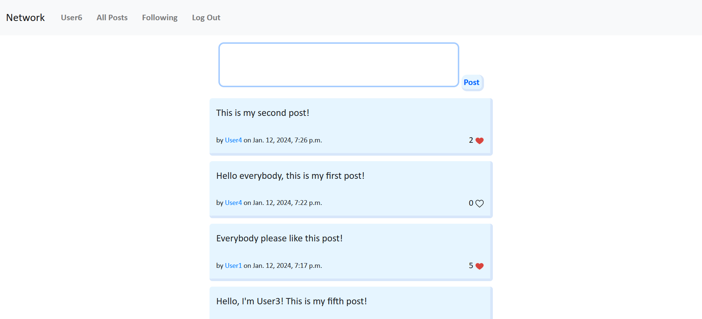

# Social network

### Features
- User authentication
- Users can create/edit posts and like posts
- Users can follow eachother and amount of followers is tracked

### Tech
- Django back-end
- JavaScript front-end
- API calls

